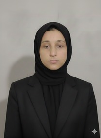

<!--
  KANWAL FATIMA — GITHUB PROFILE README
  --------------------------------------
  SETUP:
  1. Create a repo named EXACTLY "KanwalAi" (same as your GitHub username).
  2. Save this file inside it as README.md — GitHub shows it on your profile automatically.
  3. Add your photo: create a folder "assets" in that repo, upload your photo there as
     "profile.jpg", then the image line below will pick it up automatically.
  4. Double-check the project repo links near the bottom match your real repo names.
-->

<!-- Profile photo — upload your photo to /assets/profile.jpg in this repo -->

 

 

### 👩‍💻 About Me

- 🎓 B.S. Artificial Intelligence @ **FAST-NUCES, Islamabad** (2024 – Present)
- 🛠️ Hands-on across **Full-Stack Web Development, Game Development, Robotics & Systems Programming**
- 🤖 Exhibited an autonomous Arduino robot at the **PAI & IDS Robotics Exhibition**
- 📚 Volunteer tutor — broke down complex subjects for diverse learners at Pehli Kiran School
- 💬 Ask me about **PHP/MySQL apps, C++ game dev with SFML, or Arduino robotics**
- 📫 **kanwal.ai.pk@gmail.com**

### 🛠️ Tech Stack

**Languages**

**Web & Frameworks**

**Robotics & Embedded**

**Tools**

### 📊 GitHub Stats

### 🐍 Contribution Snake

> ⚙️ Setup: Settings → Actions → add the free **Platane/snk** action to this repo.
> It auto-generates the snake above from your contribution graph on a schedule.
> https://github.com/Platane/snk

### 🌟 Featured Projects

<table>
<tr>
<td width="50%">

**🤖 [RainRover](https://github.com/KanwalAi/RainRover)** — Autonomous Vehicle
`Arduino` `Sensors` `Servo` `Motor Driver`
Self-parking IR line-following robot with a rain sensor that auto-triggers a convertible rooftop. Exhibited at the PAI & IDS Robotics Exhibition.

</td>
<td width="50%">

**⚡ [OpticCLI](https://github.com/KanwalAi/OpticCLI)** — AI CLI Assistant
`C#` `.NET` `AI APIs` `Automation`
An AI-powered command-line assistant that understands natural language commands and automates developer workflows.

</td>
</tr>
<tr>
<td width="50%">

**🛒 [ElectroStore](https://github.com/KanwalAi/ElectroStore)** — E-Commerce Platform
`PHP` `MySQL` `Bootstrap` `JavaScript`
Full-stack store with customer & admin modules, secure session auth, product filtering, and order management.

</td>
<td width="50%">

**🍽️ [Halal Delights](https://github.com/KanwalAi/Halal-Delights)** — Food Ordering
`PHP` `MySQL` `Bootstrap` `PHPMailer`
Restaurant ordering platform with full CRUD for menus, cart management, and an admin dashboard.

</td>
</tr>
<tr>
<td width="50%">

**🏃 [Subway Surfers 2D](https://github.com/KanwalAi/Subway-Surfers-2D)** — Infinite Runner
`C++` `SFML` `OOP`
3-lane endless runner built with inheritance & polymorphism, featuring dynamic obstacles and power-ups.

</td>
<td width="50%">

**🚕 [Rush Hour Taxi](https://github.com/KanwalAi/Rush-Hour-Taxi)** — Assembly Arcade Game
`x86 Assembly` `MASM` `Irvine32`
An arcade taxi simulation built entirely in x86 Assembly with file-based leaderboards and sound.

</td>
</tr>
<tr>
<td width="50%" colspan="2">

**🎮 [Xonix](https://github.com/KanwalAi/Xonix)** — Territory Capture Game
`C++` `SFML` `Multiplayer` `OOP`
Classic Xonix rebuilt with multiplayer support, dynamic difficulty, and a modular multi-file design.

</td>
</tr>
</table>

### 🎓 Education & Achievements

- 🎓 **B.S. Artificial Intelligence** — FAST-NUCES, Islamabad (2024 – Expected 2028)
- 🏆 **PAI & IDS Robotics Exhibition** — Participant (ISB FSC Certificate)
- 🌱 **Volunteer Student Tutor** — Pehli Kiran School (Jan – June 2025)

### 📈 Coding Activity

<!-- Optional: connect a WakaTime account, then uncomment this block
### ⏱️ WakaTime Weekly Stats

-->

### 🔗 Connect With Me

