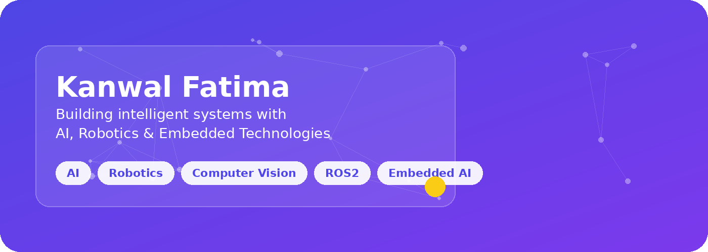

  

  

  
AI Engineer • Robotics • Software Engineer

  <h1 style="margin:0 0 10px; font-size:38px; line-height:1.08; color:#F8FAFC;">Kanwal Fatima</h1>
  
Building intelligent systems that move from research to real-world impact.

  
I’m a student and builder exploring artificial intelligence, robotics, computer vision, embedded systems, and desktop software with a strong focus on practical, human-centered tools.

  

    
    
    
  

  

    
    
    
    
    
  

  ✦ AI • Robotics • Computer Vision • ROS2 • Embedded Systems ✦

 

## About Me

  I build systems that merge thoughtful software engineering with intelligent behavior — from desktop tools and embedded platforms to robotics and computer vision.

<table width="100%" cellpadding="12" cellspacing="0">
  <tr>
    <td style="background:linear-gradient(135deg,rgba(37,99,235,0.18),rgba(124,58,237,0.14)); border-radius:18px; padding:16px;">
      <b>Current Focus</b> Robotics, ROS2, computer vision, embedded AI, and desktop applications.
    </td>
    <td style="background:linear-gradient(135deg,rgba(124,58,237,0.16),rgba(15,23,42,0.08)); border-radius:18px; padding:16px;">
      <b>Learning</b> Systems thinking, autonomous behavior, and practical AI deployment.
    </td>
    <td style="background:linear-gradient(135deg,rgba(34,211,238,0.14),rgba(59,130,246,0.12)); border-radius:18px; padding:16px;">
      <b>Research Interests</b> Computer vision, embedded intelligence, and human-centered robotics.
    </td>
  </tr>
</table>

 

## Tech Stack

Auto-detected from repositories and project manifests.

<!--START_TECH_STACK-->

<b>Languages</b>

<b>Frontend</b>

<b>Backend</b>

<b>AI / ML</b>

<b>Embedded & Robotics</b>

<b>Tools & DevOps</b>

<!--END_TECH_STACK-->

 

## Featured Projects

Selected repositories that reflect the direction of my work across AI, robotics, and software engineering.

<!--START_PROJECTS-->
<table width="100%" cellpadding="0" cellspacing="0" style="margin-bottom:12px;">
  <tr>
    <td style="background:linear-gradient(135deg,rgba(37,99,235,0.16),rgba(124,58,237,0.14)); border-radius:20px; padding:18px;">
      <h3 style="margin:0 0 8px; color:#F8FAFC;">OpticCli</h3>
      
AI-assisted Windows desktop application that translates natural language into PowerShell commands with risk analysis and visual output.

      
  

      
   

      
<a href="https://github.com/KanwalAi/OpticCli">Repository ↗</a>

    </td>
  </tr>
</table>
<table width="100%" cellpadding="0" cellspacing="0" style="margin-bottom:12px;">
  <tr>
    <td style="background:linear-gradient(135deg,rgba(37,99,235,0.16),rgba(124,58,237,0.14)); border-radius:20px; padding:18px;">
      <h3 style="margin:0 0 8px; color:#F8FAFC;">RainRover-AI</h3>
      
An autonomous Arduino-powered mobile robot featuring IR-based line following, ultrasonic self-parking algorithms, and a weather-responsive convertible rooftop system integrated through physical AI.

      
  

      
   

      
<a href="https://github.com/KanwalAi/RainRover-AI">Repository ↗</a>

    </td>
  </tr>
</table>
<table width="100%" cellpadding="0" cellspacing="0" style="margin-bottom:12px;">
  <tr>
    <td style="background:linear-gradient(135deg,rgba(37,99,235,0.16),rgba(124,58,237,0.14)); border-radius:20px; padding:18px;">
      <h3 style="margin:0 0 8px; color:#F8FAFC;">RUSH-HOUR-GAME</h3>
      
A retro-style 2D taxi simulator built in x86 Assembly featuring procedural grid generation, dynamic NPC traffic, and a persistent file-based leaderboard.

      
  

      
   

      
<a href="https://github.com/KanwalAi/RUSH-HOUR-GAME">Repository ↗</a>

    </td>
  </tr>
</table>
<table width="100%" cellpadding="0" cellspacing="0" style="margin-bottom:12px;">
  <tr>
    <td style="background:linear-gradient(135deg,rgba(37,99,235,0.16),rgba(124,58,237,0.14)); border-radius:20px; padding:18px;">
      <h3 style="margin:0 0 8px; color:#F8FAFC;">Xonix-Game-Development-Project</h3>
      
A modular C++ arcade game featuring territory-claiming mechanics, multi-player co-op, and time-based difficulty scaling powered by dynamic collision logic.

      
  

      
   

      
<a href="https://github.com/KanwalAi/Xonix-Game-Development-Project">Repository ↗</a>

    </td>
  </tr>
</table>
<!--END_PROJECTS-->

  <a href="https://github.com/KanwalAi?tab=repositories"><b>View all repositories →</b></a>

 

## GitHub Dashboard

<table width="100%" cellpadding="10" cellspacing="0">
  <tr>
    <td align="center">
      
    </td>
    <td align="center">
      
    </td>
  </tr>
</table>

  

  

 

## Journey

A simple view of how the work has evolved over time.

  <b>2024</b> Started BS Artificial Intelligence at FAST-NUCES  
  ↓  
  <b>2025</b> Built desktop, embedded, and game development projects  
  ↓  
  <b>2026</b> Working on AI desktop software, computer vision, and robotics  
  ↓  
  <b>Future</b> Physical AI, ROS2, and foundation model-driven systems

 

## Currently Building

<table width="100%" cellpadding="12" cellspacing="0">
  <tr>
    <td style="background:linear-gradient(135deg,rgba(124,58,237,0.16),rgba(15,23,42,0.08)); border-radius:18px; padding:16px;">
      <b>OpticCli</b> AI desktop software with practical command assistance.
    </td>
    <td style="background:linear-gradient(135deg,rgba(59,130,246,0.14),rgba(37,99,235,0.12)); border-radius:18px; padding:16px;">
      <b>ROS2</b> Learning robotics workflows and real-world autonomy.
    </td>
    <td style="background:linear-gradient(135deg,rgba(34,211,238,0.14),rgba(124,58,237,0.12)); border-radius:18px; padding:16px;">
      <b>Computer Vision</b> Exploring perception-driven systems and intelligent interfaces.
    </td>
  </tr>
</table>

 

## Quote

  “In the era of AI, understanding problems matters more than memorizing commands.”

 

## Let’s Connect

  
  
  
  

Made with ❤️ by Kanwal Fatima

