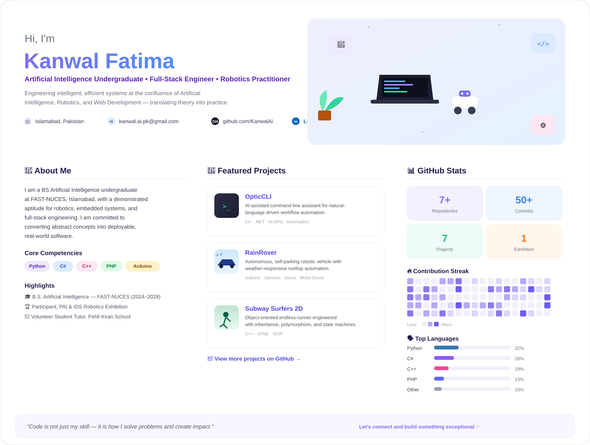

<!--
  KANWAL FATIMA — GITHUB PROFILE README
  --------------------------------------
  SETUP:
  1. Create a repo named EXACTLY "KanwalAi" (same as your GitHub username).
  2. Upload the "assets" folder (with hero-banner.svg inside) to that repo,
     keeping the folder structure, then save this file as README.md.
  3. The banner's numbers, bar percentages, and heatmap are hand-set for visual
     polish, not live-fetched — open assets/hero-banner.svg in a text editor if
     you want to update any <text> value later.
  4. Set your real Portfolio URL — search "Portfolio" inside the SVG file and
     replace the href="#" with your link.
  5. The three featured cards (OpticCLI, RainRover, Subway Surfers 2D) link
     straight to those repos — confirm the repo names match exactly.
-->

  

  

